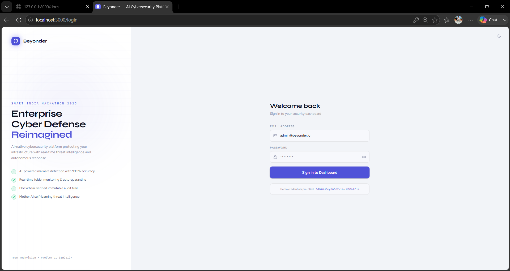
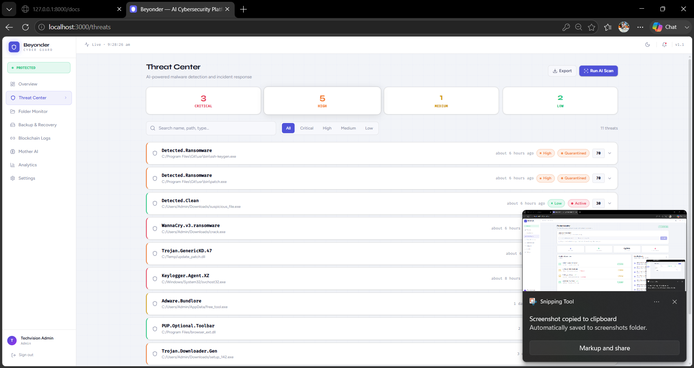
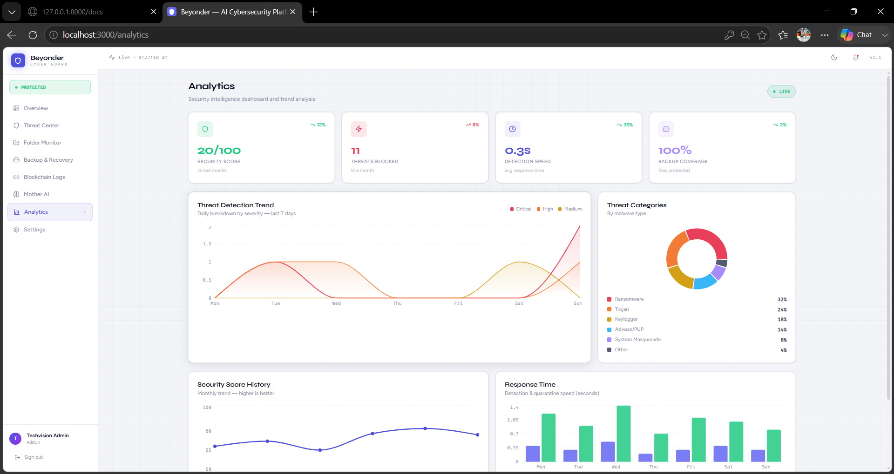

<<<<<<< HEAD
# 🛡️ Beyonder — AI-Powered Cybersecurity Platform

Overview

Beyonder is an advanced cybersecurity and digital resilience platform designed to provide real-time threat monitoring, intelligent security analytics, blockchain-based audit logging, automated backup management, and AI-powered security assistance.

The platform combines modern web technologies with cybersecurity concepts to create a centralized dashboard for monitoring, detecting, and responding to security events.

## Quick Start

### Backend
```bash
cd backend
pip install -r requirements.txt
cp .env.example .env
# Generate real secrets:
python -c "import secrets; print(secrets.token_urlsafe(32))"
uvicorn app.main:app --reload --port 8000
# Swagger docs: http://localhost:8000/api/docs
```

On first startup, Beyonder **automatically seeds**:
- Demo admin user (`admin@beyonder.io` / `demo1234`)
- 8 realistic threats spanning the last 7 days
- 4 monitored folders
- 2 backups (1 full + 1 incremental)
- 11 genesis blockchain audit blocks

### Frontend
```bash
cd frontend
npm install
npm run dev
# App: http://localhost:3000
```

Log in immediately with `admin@beyonder.io` / `demo1234` — the dashboard is populated from the start.


## 📸 Screenshots

> UI previews of the Beyonder system modules

### Dashboard


### Threat Center


### Analytics


### Backup & Recovery


### Blockchain Logs


### Mother AI


---
## Architecture

```
Frontend (React + Vite, lazy-loaded routes)     Backend (FastAPI)
──────────────────────────────────────────     ─────────────────────────────────
src/
├── services/api.ts          ───────────────►  /api/v1/auth          JWT, refresh, lockout
├── hooks/useApi.ts                             /api/v1/threats       AI scan, quarantine, history
├── store/{auth,theme}Store.ts                  /api/v1/backup        Incremental, validate, restore
├── types/index.ts                              /api/v1/monitor       Folders, live fs events
└── pages/                                      /api/v1/blockchain    SHA-256 chain, verify, CSV export
    ├── Login        (split-panel, theme toggle)/api/v1/mother-ai     patterns, similar, predict, chat
    ├── Dashboard     (live charts)             /api/v1/notifications CRUD + unread count
    ├── ThreatCenter
    ├── FolderMonitor (live event feed)         Services:
    ├── BackupRecovery (recovery logs)          ├── threat_engine.py     7-signal AI scoring
    ├── BlockchainLogs (CSV export)             ├── fs_monitor.py        watchdog OS events
    ├── MotherAI       (pattern/similarity chat)├── ai_intelligence.py   pattern/similarity/predict
    ├── Analytics      (5 chart types)          ├── blockchain_service.py SHA-256 chaining
    └── Settings       (theme, password)        └── seed_data.py         idempotent demo data
```

## Theme System

- `data-theme="dark"` / `data-theme="light"` on `<html>`, driven by CSS custom properties in `index.css`
- Toggle via `ThemeToggle` component (topbar + Settings page)
- Persisted via Zustand `persist` to `localStorage` — applied **before** React renders (no flash)

## Key Features (v1.2)
| Feature | Implementation |
|---------|---------------|
| Real folder monitoring | `watchdog` Observer per folder — create/modify/delete/rename → live feed |
| Incremental backups | Linked via `parent_backup_id`, 2–12% delta sizing |
| Backup validation | SHA-256 checksum manifest, re-verifiable on demand |
| Recovery logs | `validating → restoring → complete/failed` with checksum step |
| Mother AI pattern learning | 30-day aggregation of threat types & directories |
| Mother AI similarity | Jaccard similarity over feature sets (type, dir, level, score bucket) |
| Mother AI prediction | Weighted moving average + trend extrapolation |
| Analytics | Threat trend, category pie, security score history, response time, KPIs |
| Responsive | Mobile drawer sidebar, responsive grids, lazy-loaded routes |
| Auto-seed | Demo admin + realistic data on every fresh startup |
=======


## Project Goal

To create an intelligent cybersecurity ecosystem capable of detecting suspicious activities, protecting critical data, maintaining audit integrity, and assisting users through AI-driven security insights.

## Use Cases

* Cybersecurity Monitoring
* Threat Intelligence
* Secure Backup Management
* Audit & Compliance Tracking
* Security Analytics
* Academic Research & Demonstration

## Future Scope

* Advanced Machine Learning Threat Detection
* Cloud Backup Integration
* Multi-Device Security Monitoring
* SIEM Integration
* Enterprise Security Operations Center (SOC) Features

